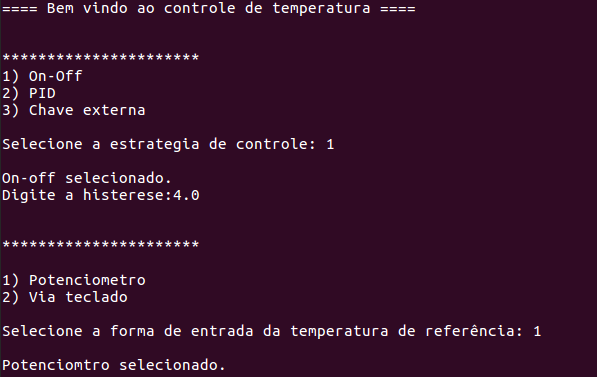
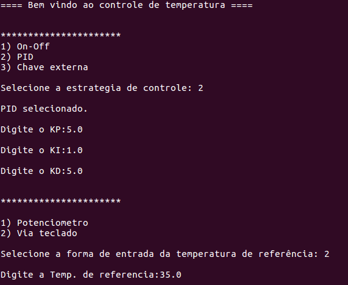

# FSE_Projeto1

## Dados

| Aluno | Matrícula |
| --- | --- |
| Eugênio Sales Siqueira | 17/0033112 |

## Introdução

Este trabalho tem por objetivo a implementação do software de uma bancada para testes de controle de temperatura de um sistema que possui internamente dois dispositivos para alterar sua temperatura. O primeiro é um resistor de potência de 15 Watts utilizado para aumentar temperatura e o segundo, uma ventoinha que puxa o ar externo (temperatura ambiente) para reduzir a temperatura do sistema.

O escopo inteiro pode ser encontrado em: https://gitlab.com/fse_fga/projetos_2021_1/projeto-1-2021-1

## Execução

``` bash
$ git clone https://github.com/Eugeniosales/fse-sistema-controle-temperatura.git

$ cd FSE_Projeto1/

$ make

$ make run
```
## Telas
Com a execução do comando é esperado o seguinte resultado:



Nesse primeira execução é:

1. Selecionado o controlador On OFF
2. Requisitado a histerese
3. E requisitado a temperatura de referência no potenciômetro

Em outra execução:



Nesse exemplo é:

1. Selecionado o controlador PID
2. Requisitado o valor das constantes KI, KP e KD
3. E a temperatura de referência é definida pela entrada padrão


## Resultados e discussões

Todos os módulos solicitados foram impletados. No entanto, devido a um problema em utilizar a GPIO, não foi possível realizar os experimentos. Entretanto, a utilização da UART, sensor BME e escrita no LCD foram executadas com sucesso.

O csv foi gerado com os valores de leitura dos sensores e o sinal do controle se manteve em 100 tanto para o on off quanto para PID. Isso deve-se ao fato de que não foi conseguido acionar o resistor pelo GPIO e a temperatura interna se manteve praticamente constante.

## Referências

[Controle Liga/Desliga - Wikipedia](https://pt.wikipedia.org/wiki/Controle_liga-desliga)  
[Controle PID - Wikipedia](https://pt.wikipedia.org/wiki/Controlador_proporcional_integral_derivativo)  
[Driver da Bosh para o sensor BME280](https://github.com/BoschSensortec/BME280_driver)  
[Biblioteca BCM2835 - GPIO](http://www.airspayce.com/mikem/bcm2835/)  
[Controle do LCD 16x2 em C](http://www.bristolwatch.com/rpi/i2clcd.htm)  
[Biblioteca WiringPi GPIO](http://wiringpi.com)  
[PWM via WiringPi](https://www.electronicwings.com/raspberry-pi/raspberry-pi-pwm-generation-using-python-and-c)
